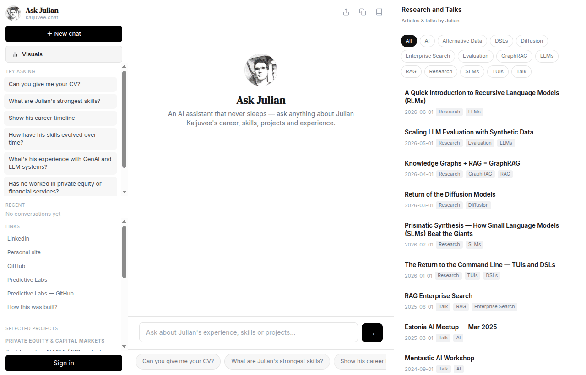
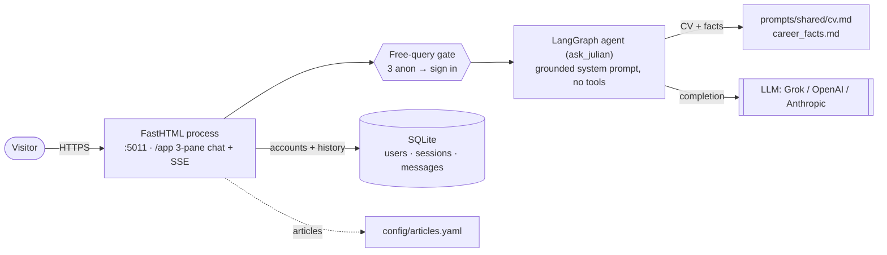
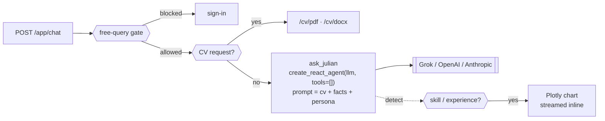

# Ask Julian — kaljuvee.chat

A personal AI chatbot that answers questions about **Julian Kaljuvee's**
career, skills, experience and projects. Answers are **grounded in Julian's CV** (`docs/`) —
the full CV plus a curated facts file are injected into the system prompt, so the assistant
stays factual and points visitors to the right links and contact details.

Built with **FastHTML** (server-rendered hypermedia + SSE streaming), a single **LangGraph**
agent, and a small **SQLite** database. Provider-agnostic LLM layer (xAI Grok by default;
OpenAI or Anthropic with one env change).



> 📐 Full system design with diagrams: **[docs/architecture_readme.md](docs/architecture_readme.md)**

---

## Architecture at a glance



**Agent path** — deterministic branches (sign-in gate, CV-download intercept, chart
detection) wrap a single grounded LangGraph agent, so side-effects stay predictable and the
LLM only does free-form Q&A:



See **[docs/architecture_readme.md §4](docs/architecture_readme.md)** for the detailed agent diagram.

---

## Features

- **Grounded Q&A** — no RAG or vector DB. The whole CV (`prompts/shared/cv.md`) plus curated
  facts (`prompts/shared/career_facts.md`) are composed into one system prompt. Factual,
  deterministic, cheap; updates are a single file edit.
- **"Ask Julian" persona** — neutral, third-person assistant with guardrails: refuses
  off-topic requests and prompt-injection, and directs visitors to contact/links.
- **3-free-query gate** — anonymous visitors get 3 free questions (session-cookie counter),
  then must sign in to continue. Any sign-in (email/password or Google) unlocks unlimited.
  Protects against bots and token drain. Tunable via `FREE_QUERY_LIMIT`.
- **Left nav** — portrait logo, sample questions, profile links (LinkedIn, personal site,
  GitHub, Predictive Labs + org), and selected projects grouped by sector.
- **Right pane** — a tag-filterable Articles/writing feed from `config/articles.yaml`
  (append one line per post; optional RSS auto-merge via feedparser).
- **Auth** — email/password with verification + reset, and Google OAuth. Chat history is
  saved per user and individual conversations can be shared via a link.

## Project structure

```
main.py                 FastHTML app: /, /app, /health, mounts /static + /img
agents/
  registry.py           single AgentSpec (ask_julian) + sample questions
  router.py             trivial router → ask_julian
  base.py               composes the grounded system prompt, builds the agent
  career/ask_julian.py  create_react_agent(llm, tools=[])
chat/
  routes.py             /app, SSE /app/chat (with the free-query gate), share
  components.py         3-pane UI: left nav, center chat, right articles
  layout.py             page shell / <head> / branding
  sse.py                SSE event helpers (incl. GATE)
auth/                   register/login/verify/reset + Google OAuth (SQLite)
prompts/
  system/ask_julian.md  persona + rules
  shared/cv.md          verbatim CV (source of truth)
  shared/career_facts.md company, projects by sector, links
config/articles.yaml    articles feed source (+ optional rss_feeds)
utils/
  llm.py                provider dispatch (xai / openai / anthropic) via LangChain
  articles.py           load + merge + dedup articles (15-min cache)
  config.py             env-driven Settings
  session.py            auth + anon query counter helpers
db.py                   SQLite engine + init (3 tables)
static/                 app.css, chat.js
img/                    portrait (favicon, logo, avatar)
tests/test_smoke.py     structural smoke tests
docs/architecture_readme.md   full architecture with Mermaid diagrams
```

## Run locally

```bash
python3 -m venv .venv && source .venv/bin/activate   # or: uv venv
pip install -r requirements.txt                       # or: uv pip install -r requirements.txt
cp env.sample .env    # add XAI_API_KEY (Grok) — or OPENAI_API_KEY / ANTHROPIC_API_KEY
python main.py        # http://localhost:5011
```

The SQLite file (`kaljuvee_chat.db`) is created automatically on first run.

```bash
pytest -q             # run the smoke tests
```

## Configuration

Key `.env` settings (see `env.sample`):

| Variable | Purpose | Default |
|---|---|---|
| `LLM_PROVIDER` | `xai` (Grok) · `openai` · `anthropic` | `xai` |
| `XAI_API_KEY` / `OPENAI_API_KEY` / `ANTHROPIC_API_KEY` | provider key | — |
| `FREE_QUERY_LIMIT` | free anonymous queries before sign-in | `3` |
| `DB_URL` | database URL | `sqlite:///kaljuvee_chat.db` |
| `SERVICE_URL` | public URL (OAuth redirect + email links) | `https://kaljuvee.chat` |
| `GOOGLE_CLIENT_ID` / `GOOGLE_CLIENT_SECRET` | optional Google sign-in | — |
| `POSTMARK_API_TOKEN` | optional, verify/reset emails | — |

Switching LLM provider is env-only (no code change). `anthropic` requires
`pip install langchain-anthropic`.

## Updating content

- **What the bot knows** — edit `prompts/shared/cv.md` and `prompts/shared/career_facts.md`.
- **How it behaves** — edit `prompts/system/ask_julian.md`.
- **Nav links & projects** — edit `PROFILE_LINKS` / `PROJECTS_BY_SECTOR` in `chat/components.py`.
- **Articles feed** — add entries to `config/articles.yaml` (or point `rss_feeds` at a blog).

## Deploy

A `Dockerfile` and `.github/workflows/deploy.yml` (Coolify webhook) are included. Push to
`main` → Coolify builds and deploys.

> **Note:** SQLite lives in a file inside the container. On Coolify, mount a **persistent
> volume** for `kaljuvee_chat.db` so chat history and accounts survive redeploys — otherwise
> the database is recreated on each deploy.
