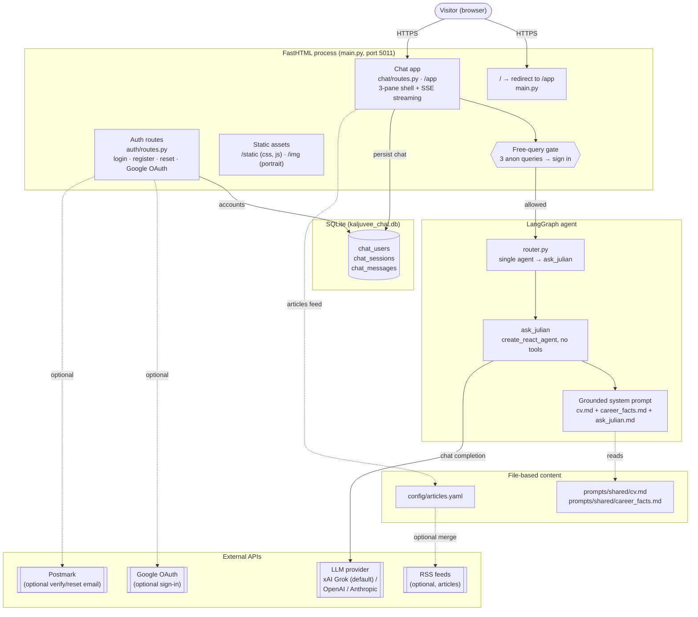
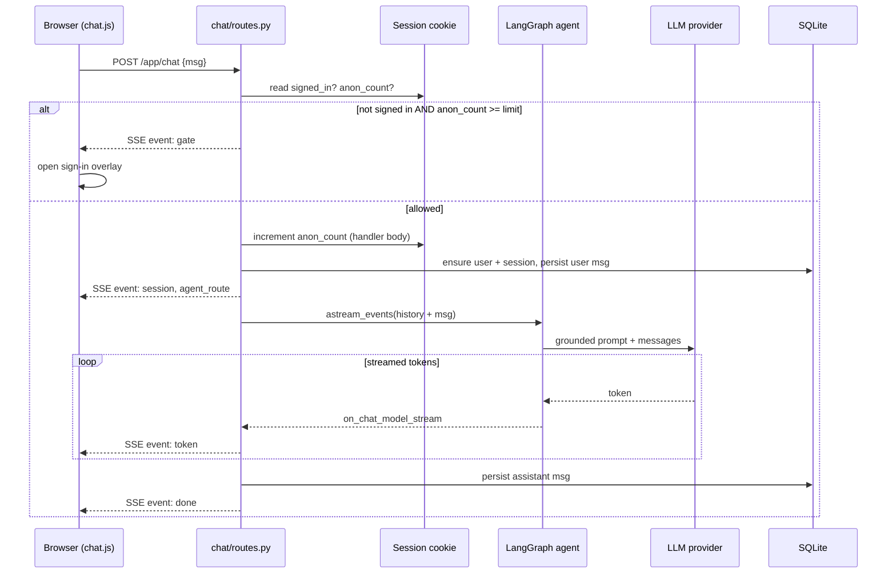
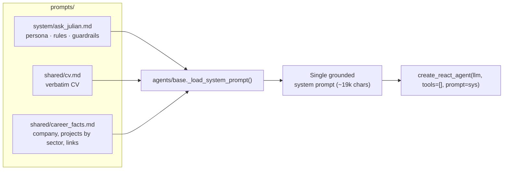
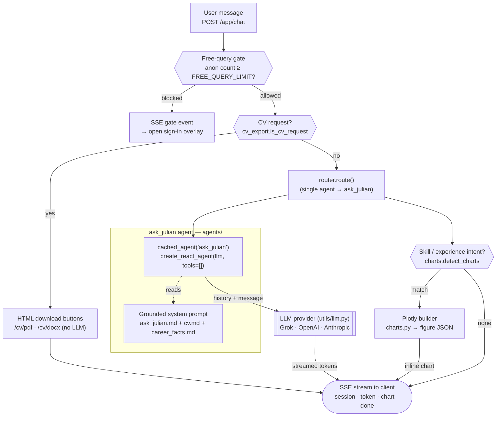
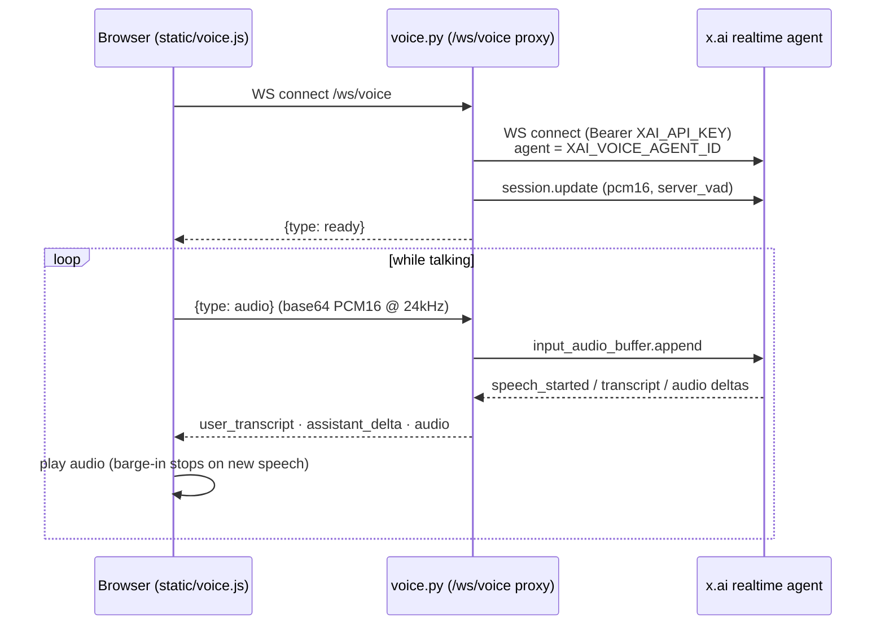
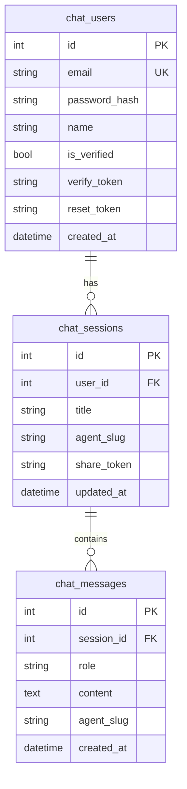
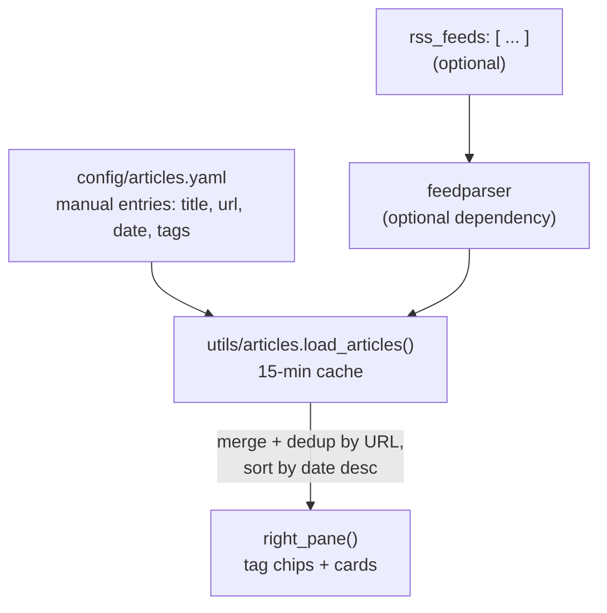
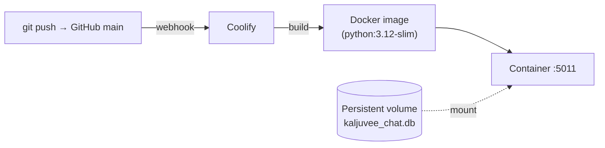

# Ask Julian — Architecture

**Ask Julian** (kaljuvee.chat) is a personal AI chatbot that answers
questions about Julian Kaljuvee's career, skills and projects. Answers are **grounded in the
CV** — the full CV plus curated facts are injected into the system prompt, so the assistant
stays factual rather than relying on retrieval or model memory.

It is built on **FastHTML** (server-rendered hypermedia + SSE streaming) with a single
**LangGraph** agent and a small **SQLite** data layer.

This document describes the system with Mermaid diagrams. Render them in any Mermaid-compatible
viewer (GitHub, VS Code, etc.).

---

## 1. High-Level System Architecture

The whole app runs as a single FastHTML process. There is no separate frontend build and no
external database service — SQLite is a file on disk, and the only network dependency at
request time is the LLM provider.

---

## 2. Chat Request Flow (with the free-query gate)

Anonymous visitors get `FREE_QUERY_LIMIT` (default **3**) free questions, tracked in the
signed session cookie. The 4th anonymous request returns a `gate` SSE event instead of an
answer, and the client opens the sign-in overlay. Any sign-in (email/password or Google)
removes the limit.

The query counter is incremented in the **route handler body** — not inside the SSE
generator — so the updated cookie is written before the streaming response starts.

---

## 3. Prompt Grounding

There is no vector store or RAG. The CV is small (~4 pages), so the full text plus a curated
facts file are concatenated into one system prompt at agent-build time. This keeps answers
deterministic and cheap, and makes updates a one-file edit.

To update what the bot knows, edit `cv.md` / `career_facts.md`; to change how it behaves,
edit `ask_julian.md`. No code changes required.

---

## 4. Agent Architecture

A single **LangGraph** ReAct agent (`ask_julian`) with **no tools** — every answer is
grounded in the composed system prompt. Two deterministic branches sit *in front of* the
agent (the CV-download intercept and the sign-in gate) and one *after* it (chart detection),
so the LLM only handles free-form Q&A while side-effects stay predictable.

To add real tool-use later, pass tools to `build_agent(spec, tools)` in
`agents/career/ask_julian.py` — the ReAct loop and SSE `tool_start`/`tool_end` plumbing are
already in place.

---

## 5. Voice Mode (talk to Julian)

Visitors can **talk instead of type**. Tapping the mic opens a live voice conversation backed
by **x.ai's realtime agent**. The browser cannot hold the API key, so a thin **WebSocket
proxy** (`voice.py`, route `/ws/voice`) bridges the browser and x.ai: it injects the
`Authorization: Bearer $XAI_API_KEY` header server-side and relays audio and events in both
directions. The voice agent is **audio-only** (spoken question → spoken answer); typed chat
still goes through the grounded LangGraph agent in §4.

Audio is PCM16 mono. `static/voice.js` captures the mic (`getUserMedia` → `ScriptProcessorNode`),
downsamples to 24 kHz, base64-encodes each frame, and streams it up; incoming audio deltas are
queued and scheduled for gap-free playback, with barge-in (playback stops when the user starts
speaking). Live user/assistant transcripts are rendered as normal chat bubbles.

Voice is enabled when `XAI_VOICE_AGENT_ID` is set (it falls back to a default agent id, and
reuses `XAI_API_KEY`). The proxy route must be registered at the front of the router —
FastHTML's catch-all host route would otherwise shadow the WebSocket path. Behind a reverse
proxy (Coolify/Traefik) WebSocket upgrades are forwarded transparently.

---

## 6. Data Model

Only chat auth and history are stored. Everything else (CV, projects, links, articles) is
file-based content, not database rows.

---

## 7. Research & Talks Feed

The right-hand pane renders a tag-filterable feed of Julian's writing. Because LinkedIn
articles are auth-gated and have no public RSS, the source of truth is a hand-curated YAML
file. Any RSS/Atom sources listed there are merged in and de-duplicated by URL, so an
RSS-capable blog updates automatically.

---

## 8. Configuration & Deployment

| Concern | Mechanism |
|---|---|
| LLM provider | `LLM_PROVIDER` = `xai` (default) / `openai` / `anthropic` — dispatched in `utils/llm.py` via LangChain |
| Voice mode | `XAI_VOICE_AGENT_ID` (x.ai realtime agent; reuses `XAI_API_KEY`) — `/ws/voice` proxy in `voice.py` |
| Free-query limit | `FREE_QUERY_LIMIT` (default 3) |
| Database | `DB_URL` (default `sqlite:///kaljuvee_chat.db`) |
| Google sign-in | `GOOGLE_CLIENT_ID` / `GOOGLE_CLIENT_SECRET`; redirect `<SERVICE_URL>/auth/google/callback` |
| Email (optional) | `POSTMARK_API_TOKEN` for verify/reset links |
| Container | `Dockerfile`; CI trigger in `.github/workflows/deploy.yml` (Coolify webhook) |

> **Deployment note:** SQLite is a single file inside the container. Mount a **persistent
> volume** for `kaljuvee_chat.db` on Coolify so accounts and chat history survive redeploys —
> otherwise the database is recreated on each deploy.
